# Граф знань для рекомендаційної системи

# Частина 1. Проєктування схеми

## Опис моделі даних

Для роботи використано датасет MovieLens. Дані представлені у вигляді графа, де користувачі оцінюють фільми, а фільми належать до певних жанрів.
Основні сутності:
- User — користувач
- Movie — фільм
- Genre — жанр
Основні зв'язки:
- `(User)-[:RATED]->(Movie)`
- `(Movie)-[:HAS_GENRE]->(Genre)`
Така модель добре підходить для задач рекомендаційних систем, оскільки дозволяє природно представляти взаємодію користувачів із контентом та виконувати складні графові запити.

## Схема графа

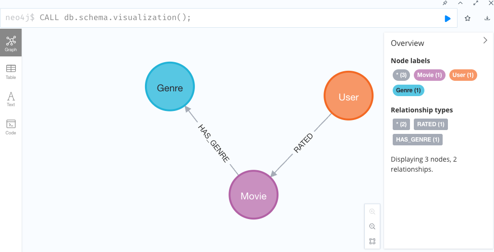

## Neo4j Browser

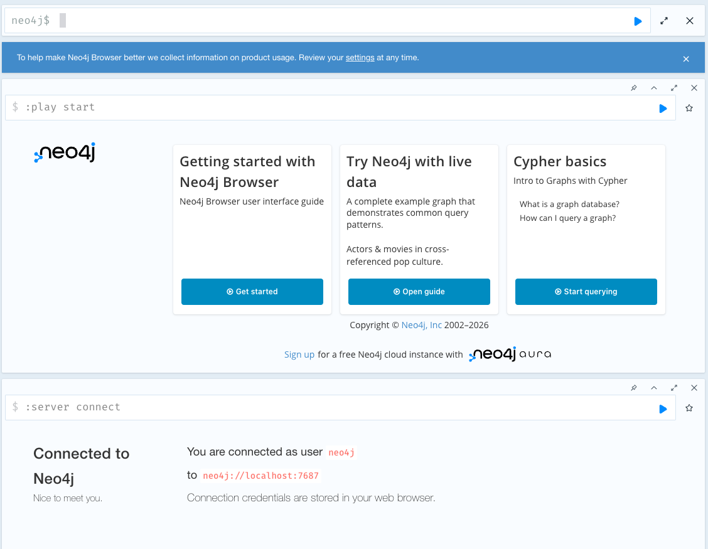

# Частина 2. Завантаження даних

## Підготовка файлів

CSV-файли були попередньо конвертовані у формат, придатний для імпорту в Neo4j.
Імпорт виконано через команду:
```bash
docker exec -i neo4j_movielens cypher-shell -u neo4j -p password123 < queries/part2_load.cypher
```

## Результат завантаження

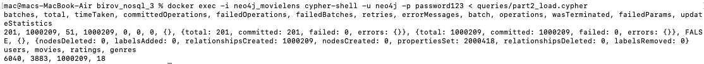

Після завантаження в базі даних міститься:

| Тип вузлів | Кількість |
|------------|------------|
| Users | 6040 |
| Movies | 3883 |
| Genres | 18 |

| Тип зв’язків | Кількість |
|--------------|------------|
| RATED | 1000209 |
| HAS_GENRE | 3883 |

Отримані значення відповідають структурі оригінального датасету MovieLens.

# Частина 3. Запити різної складності

## 3.1 Фільми жанру Thriller із середнім рейтингом понад 4

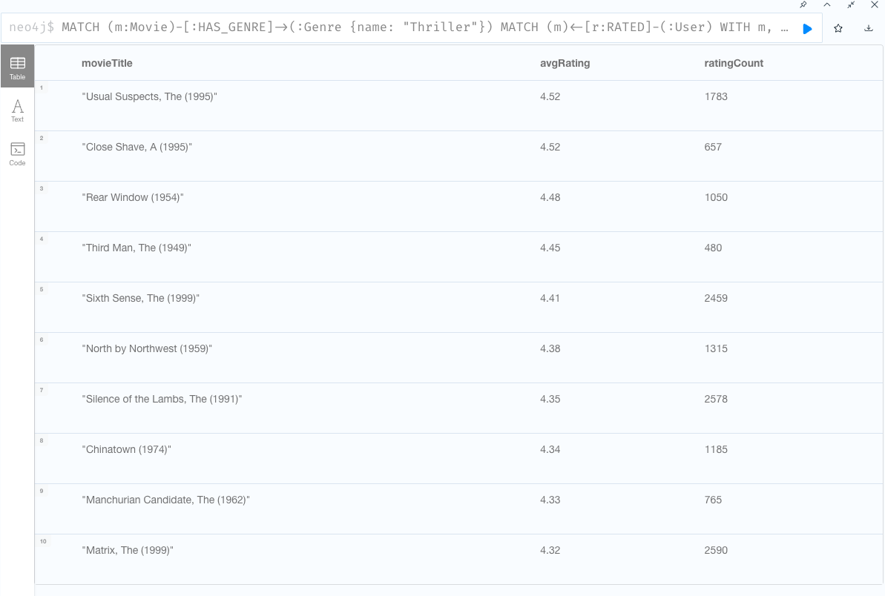

### Аналіз

Запит дозволяє знайти фільми жанру Thriller, які отримали високу середню оцінку користувачів. Такий підхід дозволяє відфільтрувати випадкові високі оцінки та знайти справді якісний контент.

## 3.2 Користувачі, які поставили найбільше оцінок 5

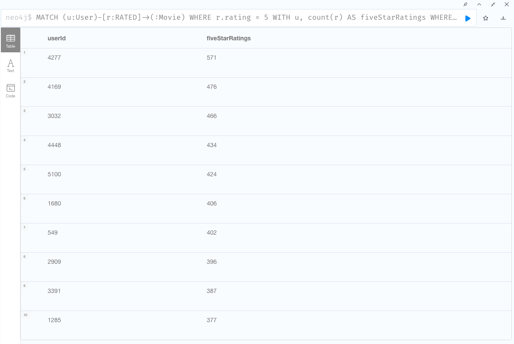

### Аналіз

Деякі користувачі значно активніші за інших і залишають велику кількість максимальних оцінок. Такі користувачі формують значну частину інформації для рекомендаційних алгоритмів.

## 3.3 Пари користувачів із найбільшою кількістю спільно оцінених фільмів

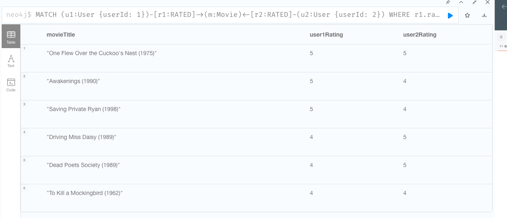

### Аналіз

Висока кількість спільно оцінених фільмів може свідчити про схожі інтереси користувачів. Саме на такій ідеї будуються багато алгоритмів collaborative filtering.

## 3.4 Жанри з найвищим середнім рейтингом

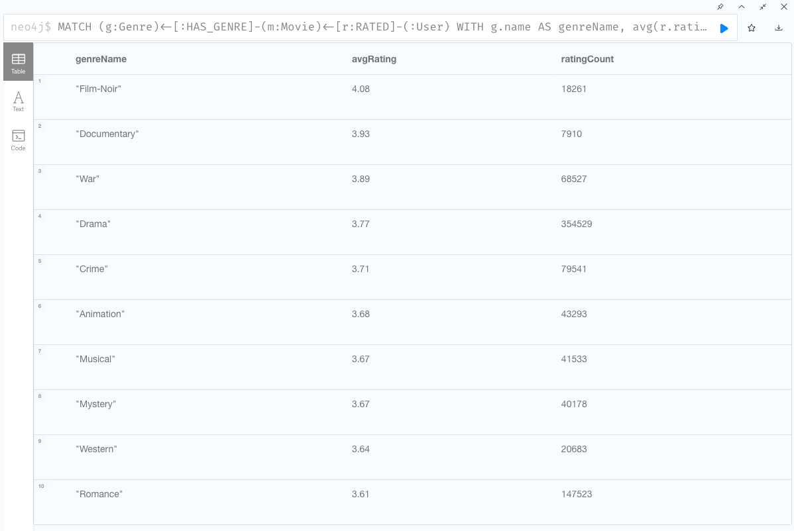

### Аналіз

Різні жанри мають різне середнє сприйняття аудиторією. Аналіз середніх рейтингів дозволяє визначити жанри, які загалом подобаються користувачам найбільше.

## 3.5 Рекомендації фільмів

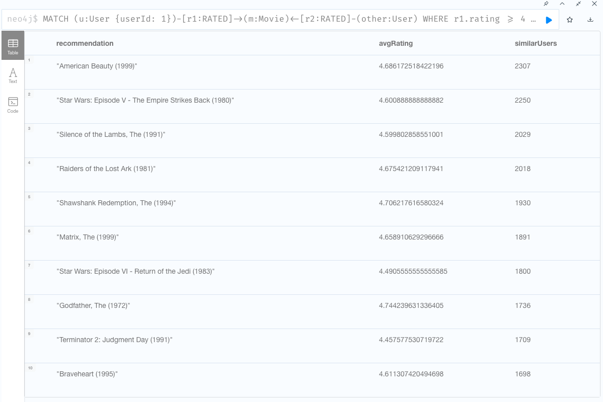

### Аналіз

Запит демонструє принцип побудови рекомендацій через пошук схожих користувачів та аналіз їхніх оцінок. Це базовий варіант рекомендаційної системи на основі графових зв'язків.

## 3.6 Найкоротший шлях між користувачами

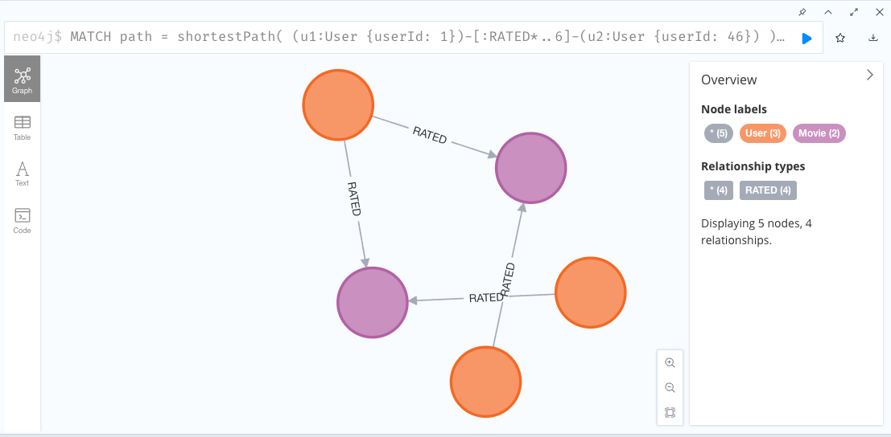

### Аналіз

Алгоритм shortest path дозволяє досліджувати зв'язки між користувачами через спільно оцінені фільми. У соціальних і рекомендаційних системах такі шляхи часто використовуються для пошуку прихованих зв'язків між об'єктами.

# Частина 4. Графові алгоритми через Cypher

## 4.1 Вузли з найбільшим степенем

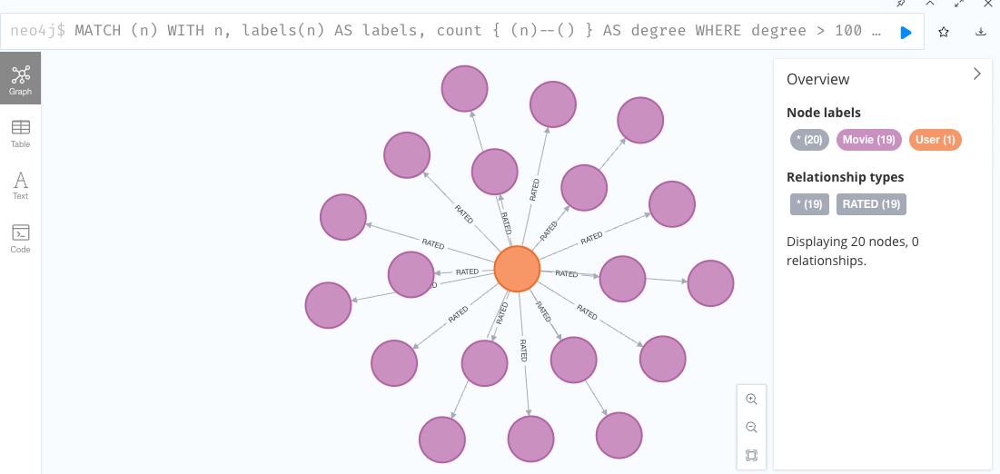

### Аналіз

Найбільший степінь мають фільми, які отримали найбільшу кількість оцінок.

Такі вузли є "хабами" графа і суттєво впливають на структуру мережі. У рекомендаційних системах вони часто виступають центральними точками зв'язку між різними групами користувачів.

## 4.2 Кількість фільмів за жанрами

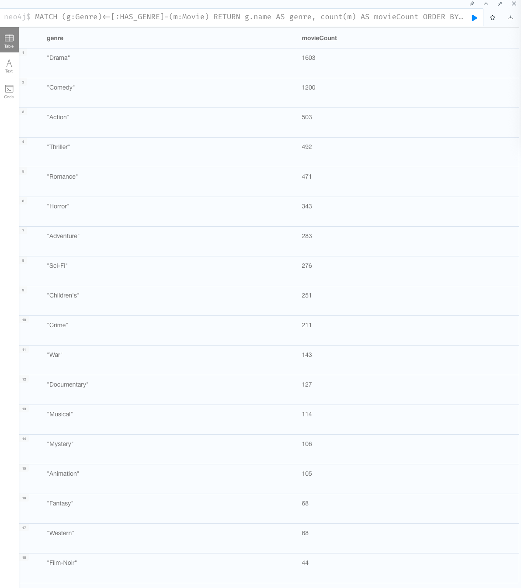

### Аналіз

Найбільшу кількість фільмів мають жанри Drama та Comedy.

Це очікуваний результат, оскільки ці жанри традиційно мають найбільше представлення у кіноіндустрії.

## 4.3 Найбільш оцінювані фільми

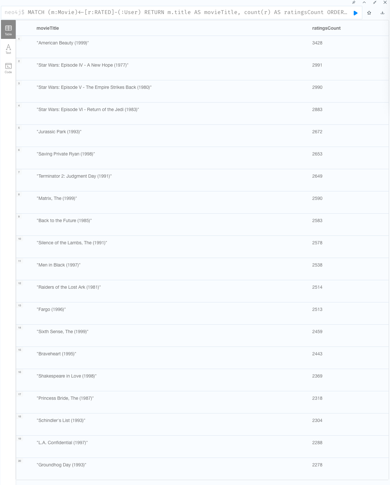

### Аналіз

Фільми з найбільшою кількістю оцінок є найбільш популярними серед користувачів.

Водночас велика кількість оцінок не завжди означає високий рейтинг, тому популярність і якість варто аналізувати окремо.

## 4.4 Найактивніші користувачі

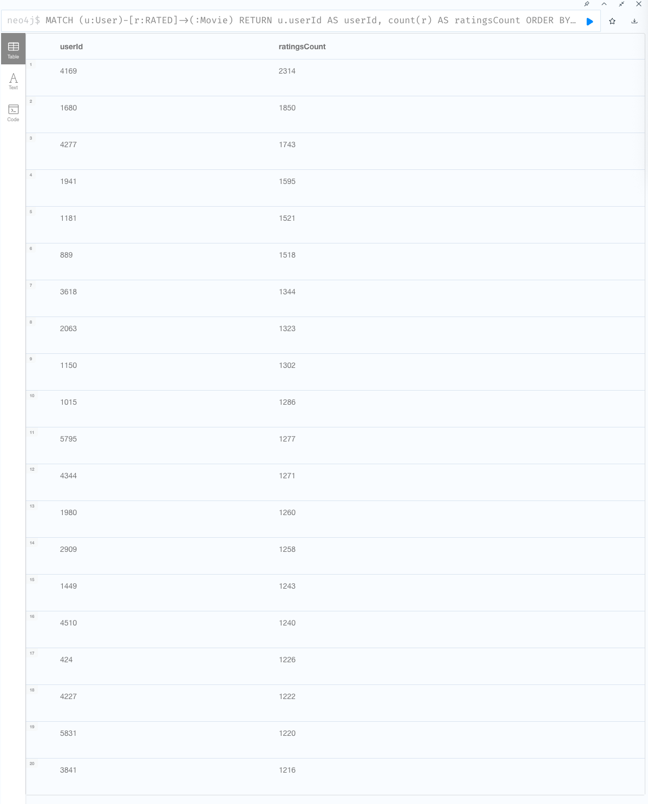

### Аналіз

Найактивніші користувачі залишили понад тисячу оцінок.

Саме такі користувачі забезпечують найбільший внесок у формування рекомендаційної моделі та покращують якість рекомендацій.

# Частина 5. Graph Data Science

## 5.1 PageRank для графа фільмів

### Створення проекції графа

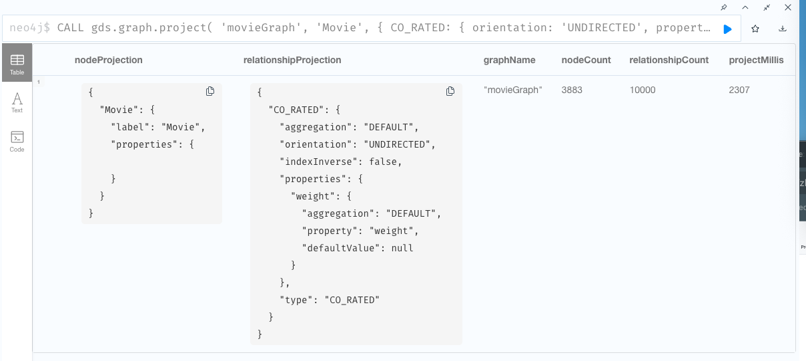

Було побудовано граф Movie → Movie через зв'язки CO_RATED між фільмами, які отримували високі оцінки від однакових користувачів.

Граф містить:

- 3883 вузли Movie
- 10000 зв'язків CO_RATED

### Результат PageRank

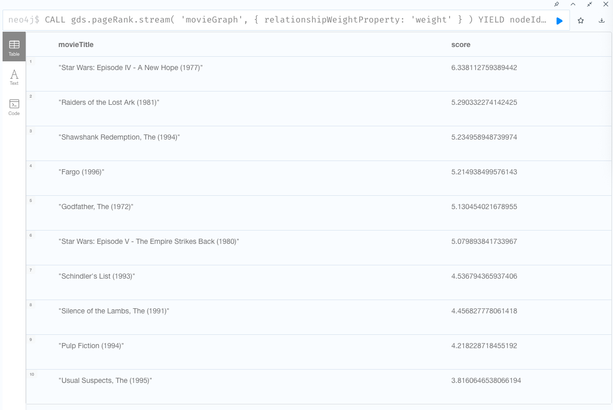

### Аналіз результатів

Найвищі значення PageRank отримали:

1. Star Wars: Episode IV – A New Hope (1977)
2. Raiders of the Lost Ark (1981)
3. The Shawshank Redemption (1994)
4. Fargo (1996)
5. The Godfather (1972)

На відміну від простого підрахунку кількості оцінок, PageRank враховує структуру графа та важливість сусідніх вузлів.

Тому високі позиції займають не лише популярні фільми, а й ті, які часто пов'язані з іншими важливими фільмами через поведінку користувачів.

Отриманий результат добре відповідає відомим класичним фільмам, які мають значний вплив у різних групах глядачів.

## 5.2 Louvain для пошуку спільнот користувачів

### Створення графа користувачів

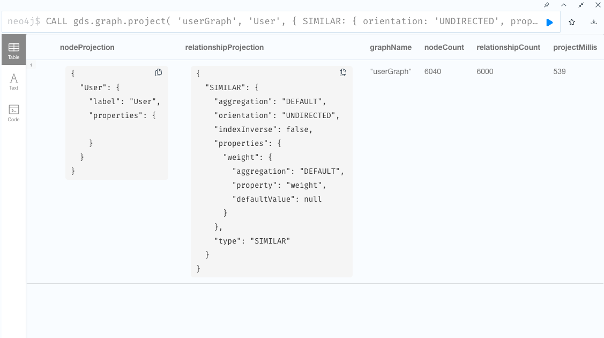

Було сформовано граф схожості користувачів на основі спільних оцінок фільмів.

### Кількість зв'язків схожості

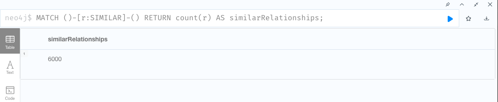

У графі було створено 6000 зв'язків SIMILAR між користувачами.

### Найбільш схожі користувачі

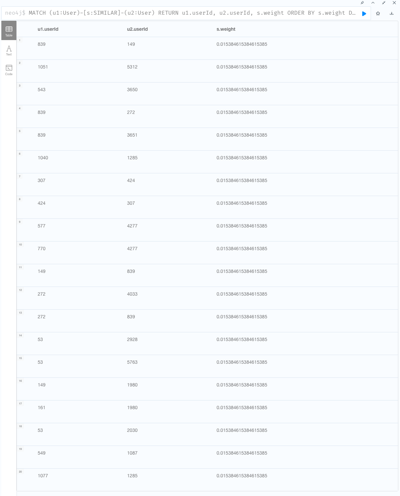

### Результати Louvain

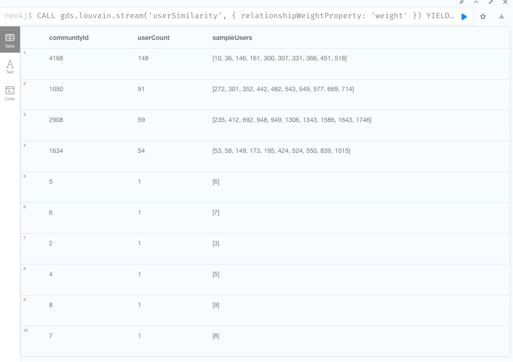

### Аналіз результатів

Алгоритм Louvain дозволив автоматично знайти спільноти користувачів зі схожими вподобаннями.

Найбільші спільноти:

| Community ID | Users |
|-------------|--------|
| 4168 | 148 |
| 1050 | 91 |
| 2908 | 59 |
| 1634 | 54 |

Окрім великих кластерів існує багато невеликих груп та окремих користувачів.

Такий результат є типовим для рекомендаційних систем: частина аудиторії формує великі групи зі схожими інтересами, а частина має більш унікальні вподобання.

Практична цінність Louvain полягає в можливості сегментувати користувачів та будувати рекомендації як для окремих людей, так і для цілих груп.

## 5.3 Найкоротший шлях між користувачами (Dijkstra)

### Повторна проекція графа

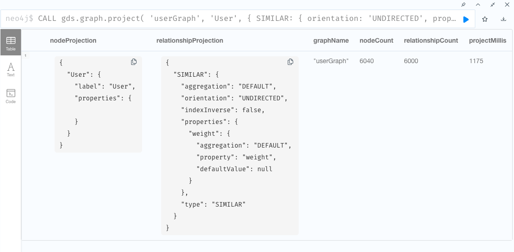

### Кількість зв'язків схожості

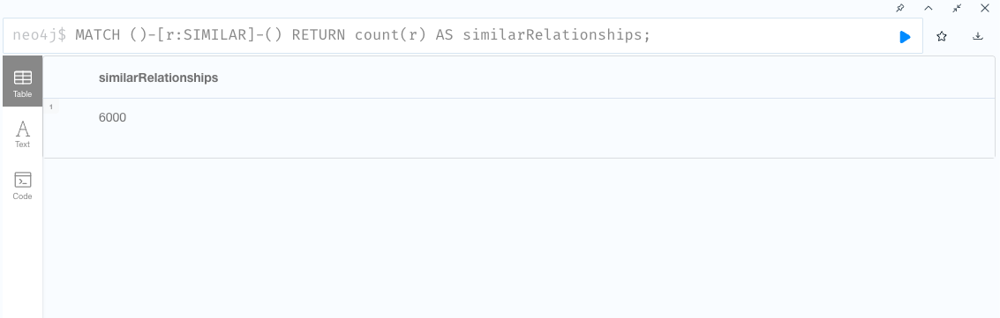

### Приклади зв'язків між користувачами

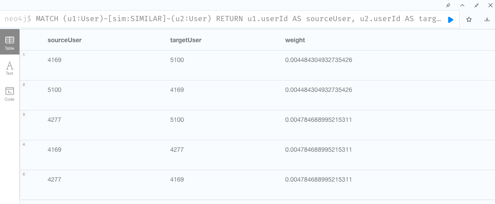

### Результат Dijkstra

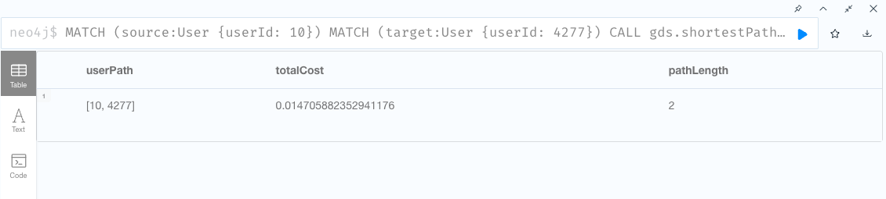

### Аналіз результатів

Для демонстрації алгоритму було знайдено найкоротший шлях між користувачами 10 та 4277.

Алгоритм знайшов прямий зв'язок:

```
[10, 4277]
```

Довжина шляху становить 2 вузли.

Це означає, що між користувачами вже існує безпосередній зв'язок через відношення SIMILAR без необхідності проходити через проміжні вузли.

У більш складних графах алгоритм Dijkstra дозволяє знаходити оптимальні маршрути між користувачами через декілька рівнів зв'язків.

# Частина 6. Власні висновки

У ході роботи було побудовано повноцінну графову модель MovieLens та виконано аналіз даних за допомогою Cypher і Graph Data Science.

Найбільш корисним виявився підхід, де дані розглядаються як мережа зв'язків, а не як окремі записи таблиць. Це дозволяє природно виконувати рекомендаційні задачі, пошук схожих користувачів та аналіз спільнот.

Алгоритм PageRank показав, що найбільш впливовими стають не лише найпопулярніші фільми, а й ті, що займають центральне місце в структурі графа.

Алгоритм Louvain продемонстрував можливість автоматичного виявлення груп користувачів зі схожими вподобаннями, що може використовуватись для сегментації аудиторії та побудови рекомендацій.

Алгоритм Dijkstra показав, як можна досліджувати зв'язки між користувачами та знаходити оптимальні маршрути в графі.

Порівняно з реляційними базами даних, графова модель значно спрощує реалізацію задач рекомендаційних систем, аналізу спільнот та пошуку зв'язків між об'єктами. Саме тому графові бази даних широко використовуються в соціальних мережах, системах рекомендацій та задачах аналізу складних взаємозв'язків.
